### 1) Настраиваем сервер с журналом

* Настраиваем сервер чтобы сбрасывались сообщения о блокировках дольше 200мс.

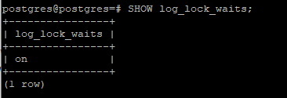
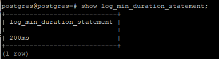
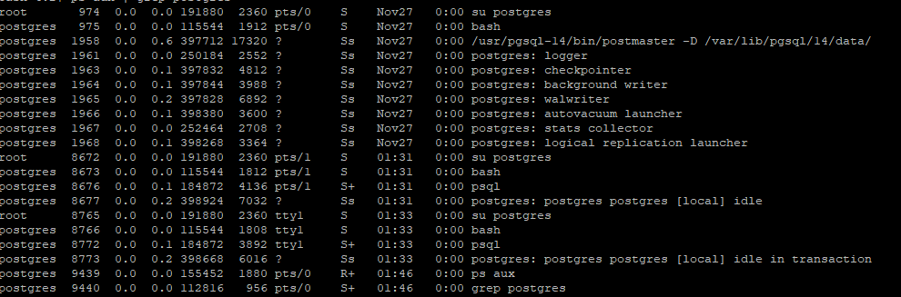

* Проверяем на примере. В одной сессии выполним простой селект, во второй блокировку таблицы.

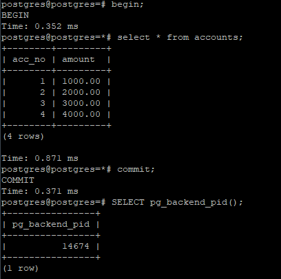
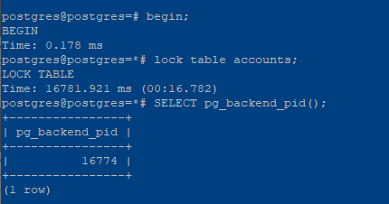

* Проверяем лог файл в директории var/lib/pgsql/14/data/postgresql-Sun.log

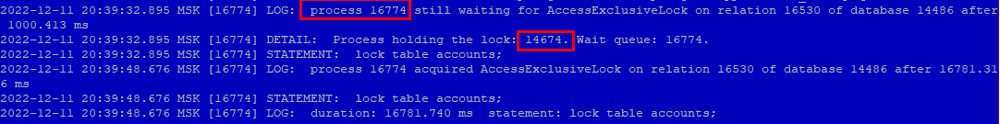

* Итак, процесс 16774 ждет выполнение для таблицы 16530 БД 14486. Блокируюший процесс - 14674.
Далее информация что наконец процесс 16774 сработал спустя 16781.316мс

### 2) Запустим 3 процесса выполняющие UPDATE одной и той же строки

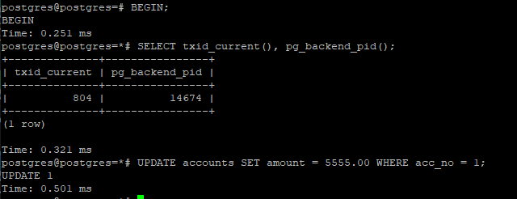

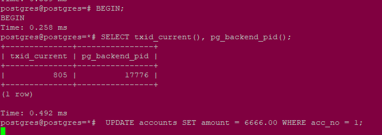

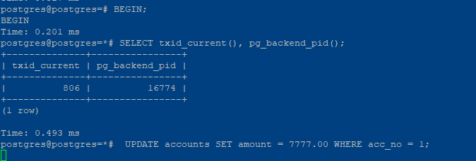

* Одна команда прошла, две другие уснули.

Блокируемые процессы можем посмотреть в pg_locks и заодно stat_activyty

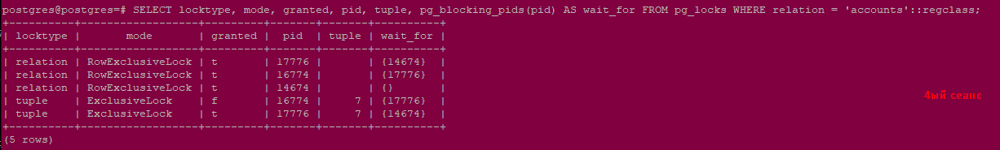

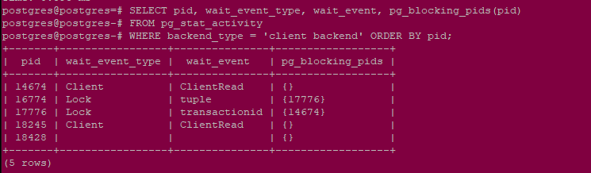

* Видно что процесс 14674 никого не ждет - стоит {}. Процесс 17776 ждет 14674, а 16774 встанет в "очередь" и заснет, но ждать он будет не 17776 а tuple7.

### 3) Взаимоблокировка 3х транзакций. 

* Получилось произвести зацикливание и получена информация: 
#### HINT: See server log for query details
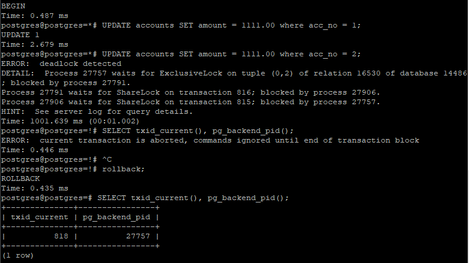
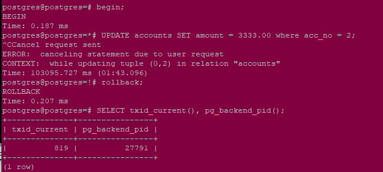

И если мы посмотрим логи сервера то увидим: 
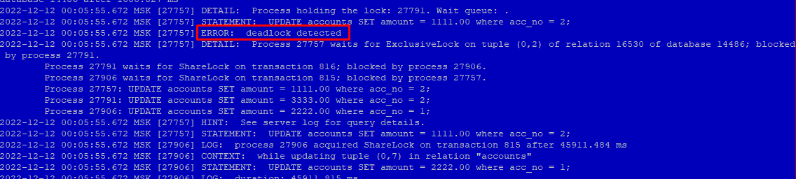

#### ERROR: deadlock detected

И дальше конкретней. И запрос на котором произошла ошибка:
#### STATEMENT: UPDATE accounts SET amount = 1111.00 where acc_no = 2;
Вследствие разрыва дедлока прошла транзакция 815 процесса 27906 спустя 45911мс.

### 4) Могут ли две транзакции, выполняющие единственную команду UPDATE одной и той же таблицы (без where), заблокировать друг друга?
Могут если идет обновление таблицы в разном порядке, тогда они могут пересекаться.

